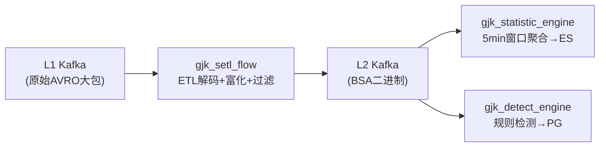
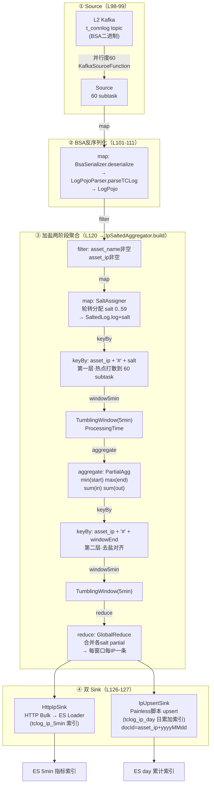

# Flink 系统性入门 —— 以 cncert_kj_job 实时流处理为教材

> 面向读者：会 Java、懂 SQL 基本语法、但无大数据背景的开发者。
> 技术栈：**Flink 1.14.2 / Java 8 / Maven**。
> 本文所有概念均以 `cncert_kj_job/` 仓库真实代码为例，可对照源码阅读。

## 1. 先建立心智模型：Flink 解决什么问题

传统数据库是「存数据等查询」：数据在硬盘里，用户问什么答什么。
Flink 反着来：**数据是流动的，处理逻辑挂在水管上，数据流过时即时计算**。

一条流水线（管道）：

```
数据源(Source) → 变换(Transformation) → 变换 → 输出(Sink)
```

每一条数据从源头进来，流水线式经过一道道工序，最后落库/落盘。**数据不等你，你只能等数据** —— 这就是“流处理”。

与熟悉概念的对照：

| 传统概念 | Flink 对应 | 说明 |
|---|---|---|
| 数据库表 | `DataStream`（无限流） | 数据无休止地流过来 |
| SQL 查询 | 算子链 + Table SQL | 处理逻辑 |
| 写入结果表 | Sink（落地） | 输出到 ES/PG/Kafka |
| 并行执行计划 | DAG 执行图 | 流水线展开成并行任务图 |

**本仓库就是一套典型管道**（参考 `docs/flink-data-skew-analysis.md`）：



4 个 Maven 模块、9 个 Flink Job，各管一段：SETL 清洗 → 统计出指标 → 检测出告警。

## 2. 最小骨架：一个 Flink 程序长什么样

看 `gjk_setl_flow` 的 `TCLogFlinkStreamer.java`，去掉配置只留骨架：

```java
public static void main(String[] args) {
    StreamExecutionEnvironment env = StreamExecutionEnvironment.getExecutionEnvironment();
    // ① 数据源
    KafkaSource<byte[]> kafkaSource = KafkaSource.<byte[]>builder()
            .setTopics(kafkaSourceTopic)
            .setProperties(gjkKafkaParam)
            .build();
    DataStreamSource<byte[]> msg = env.fromSource(kafkaSource, ...);
    // ② 变换链
    DataStream<Map<String, Object>> log = msg.flatMap(new RichFlatMapFunction<byte[], ...>(){...});
    DataStream<Map<String, Object>> outputLog = log.filter(new TCLogFilter(...))
                                                  .map(new TCLogKnowledgeMap(...));
    // ③ 输出
    outputLog.addSink(new FlinkKafkaProducer(...));
    env.execute("GJK-TCLOG-SETL");   // 启动！
}
```

四个固定环节：**建环境 → 接数据 → 加工 → 输出，最后 `env.execute()` 真正跑起来**。
`execute()` 之前的所有代码只是「图纸」，执行时才按图纸并行干活。

## 3. 核心概念逐一拆解

### 3.1 算子（Operator）：处理逻辑的积木

仓库用到的全部基础算子：

| 算子 | 作用 | 仓库实例 |
|---|---|---|
| `map` | 1 条进 1 条出 | `TCLogKnowledgeMap`（知识富化） |
| `flatMap` | 1 条进 N 条出 | AVRO 大包拆成上万条记录（吞吐放大点） |
| `filter` | 按条件放行/丢弃 | `TCLogFilter`（脏数据过滤） |
| `keyBy` | 按 key 分组 | `IpSaltedAggregator` 两阶段聚合 |
| `window` | 按时间/数量攒批计算 | 5min 滚动窗口 |
| `addSink` | 输出 | `HttpIpSink`、`PGSink01`、Kafka Producer |

`map`/`flatMap`/`filter` 是「无状态」算子：每条数据独立处理，不关心别的数据。

### 3.2 并行度与 Task：为什么快

单个算子能力有限，Flink 把算子**复制多份并行跑**，每份叫 **subtask**，份数叫**并行度（parallelism）**。

对照启动脚本 `bin/start_tclog_ip_statistic.sh`：

```bash
-Dparallelism.default=60     # 全局并行度 60
-Dtaskmanager.numberOfTaskSlots=2   # 每台机器(TaskManager)2个执行槽
```

- **TaskManager（TM）** = 一台干活的计算节点，`numberOfTaskSlots` 决定它能同时跑几个 subtask
- `parallelism.default=60` 意味算子默认拆成 60 份并行跑
- 数据在 subtask 之间流动，可能跨机器网络传输，这叫 **shuffle**

打个比方：一个算子是一张收银台，并行度 60 就是开 60 个窗口同时结账。

### 3.3 keyBy：分组背后的精髓

要统计「每个 IP 的流量总和」，必须把**同一个 IP 的所有记录送到同一个 subtask** 去累加 —— `keyBy(asset_ip)` 干的就是这件事。

Flink 对 key 做哈希决定它去哪个 subtask。关键性质：**同一 key 永远去同一 subtask**。
这就是为什么热点 key 会导致倾斜 —— 一个 IP 流量特别大，它所在的那 1 个 subtask 就特别忙。

看 `statistic/util/IpSaltedAggregator.java` 第一层 keyBy 的写法：

```java
.keyBy(s -> s.log.getAsset_ip() + "#" + s.salt)   // 加盐：热点IP拆成60份
```

## 4. 窗口（Window）：流上做“批”

无限流没法算“每秒平均值”，因为流没有尽头。解决办法：**截取固定时间段的数据当一批算**，这就是窗口。

本项目用的是**滚动窗口（Tumbling Window）**：固定长度、首尾相接、互不重叠。5 分钟一个窗口 → 每条数据恰好属于一个 5min 窗口 → 每到整 5 分钟算一次聚合。

窗口有个关键选择：**按什么时间切**？

| 时间类型 | 含义 | 风险 |
|---|---|---|
| ProcessingTime（处理时间） | 数据**到达计算节点**的墙钟时间 | 数据到达晚≠真实发生晚，但简单、低延迟 |
| EventTime（事件时间） | 数据**自带的发生时间**（如 `stream_time`） | 需要 watermark 处理乱序，复杂但准确 |

**本仓库全部用 ProcessingTime**（`TCLogIpPairMonitorMain` 注册表时声明 `proctime.proctime`）。代价是结果按“到达时间”而非“发生时间”切片，对实时告警可接受，但要知道这不是最严谨的语义 —— 未来可改进点。

## 5. Table API & SQL：用 SQL 写流处理

工程主力（9 个 Job 中 7 个用 SQL）。Flink 的杀手锏：**流也可以“假装成一张表”跑 SQL**，执行时自动翻译成 DataStream 算子。

看 `statistic/TCLogIpPairMonitorMain.java` 完整四步：

```java
// ① 把 DataStream 注册成虚拟表（最后一个字段 proctime 是窗口用的时间列）
tableEnv.createTemporaryView("pojo_log", logStream, "field1,field2,...,proctime.proctime");

// ② 注册自定义函数（UDF），SQL 里直接当函数用
tableEnv.registerFunction("TopOne", new TopOneFunction());

// ③ 写 SQL 查询（模板在 util/Constant.java）
Table ipPairTable = tableEnv.sqlQuery(IP_PAIR_SQL);

// ④ 查完的表转回 DataStream 继续加工/输出
DataStream<Row> ipPairStream = tableEnv.toDataStream(ipPairTable, Row.class);
```

SQL 模板长这样（`util/Constant.java`，概念示意）：

```sql
SELECT MIN(start_time), MAX(end_time), asset_ip,
       FIRST_VALUE(asset_name), SUM(in_bytes), SUM(out_bytes)
FROM pojo_log
WHERE CHAR_LENGTH(asset_name) <> 0
GROUP BY TUMBLE(proctime, INTERVAL '5' MINUTE), asset_ip
```

`TUMBLE(proctime, 5min)` 就是**滚动时间窗口函数**，`GROUP BY` 里除了业务维度还带了窗口 —— 表示“每个 IP 每 5 分钟”一组。Flink 会自动翻译成 `keyBy(asset_ip) + window + aggregate` 的算子图。

**注册表 vs 数据库表**：`createTemporaryView` 的表不存数据，只是把流“包装”成可查询的样子，每条数据流过即被 SQL 逻辑消费。

## 6. UDF：给 SQL 加自定义能力

内置函数不够用时自己写，仓库三类都有：

**(a) 聚合函数（AggregateFunction）**：窗口内累加，窗口结束输出一个结果。看 `statistic/udf/TopOneFunction.java`（统计每个 IP 对里出现最多的协议）：

```java
public class TopOneFunction extends AggregateFunction<Object, Map<Object, Long>> {
    @Override
    public Map<Object, Long> createAccumulator() { return new HashMap<>(); }  // 累加器

    public void accumulate(Map<Object, Long> acc, Object field) {             // 每条数据累加
        acc.put(field, acc.getOrDefault(field, 0L) + 1);
    }

    @Override
    public Object getValue(Map<Object, Long> acc) {                            // 出结果
        return acc.entrySet().stream().max(Map.Entry.comparingByValue())
                .map(Map.Entry::getKey).orElse("");
    }
}
```

三个方法角色清晰：`createAccumulator` 建账本，`accumulate` 每条数据记一笔，`getValue` 交卷。
**注意内存风险**：`Map` 账本随不同 value 数量增长 —— 仓库分析文档点名了 `PortDistribution`、`ConcatLog` 这类 UDF 状态膨胀问题。

**(b) 标量函数**：`PortToService`（端口号→服务名）
**(c) 表函数**：返回多行

## 7. 状态与容错（了解级别）

- **状态（State）**：`keyBy` 后每个 key 的“账本”（如 IP 的累计流量）就是状态，存在各 subtask 本地。你之所以要 `keyBy` 才能正确求和，就是因为状态按 key 隔离。
- **Checkpoint**：Flink 周期性给所有状态拍“快照”存到远端（HDFS/S3），配合 **Kafka 的 offset**，做到“故障重启后从快照继续，不丢不重”。这就是 Flink 的**精确一次（Exactly-Once）**语义来源。
- 仓库里消费起点 `OffsetsInitializer.committedOffsets(OffsetResetStrategy.LATEST)`（`TCLogFlinkStreamer` L111）就是“从上次提交的位置继续消费”。

## 8. 连通器（Connector）：与外部世界交互

- **Kafka Source**：`TCLogFlinkStreamer` 用新版 `KafkaSource`（`env.fromSource`）；统计/检测模块用旧版自定义 `addSource(new KafkaSourceFunction(...))`（两份 31KB 手写 Source，仓库技术债，见 Wiki）。
- **ES Sink**：`HttpIpSink` 走 HTTP Bulk 到 ES Loader 服务。
- **PG Sink**：`PGSink01-04` 批量写告警。
- 依赖都在 `pom.xml`：`flink-connector-kafka_2.11`、`flink-connector-elasticsearch6_2.11`、`bsa-serializer`（自研序列化）。

**Maven 关键点**：`flink-*` 核心依赖用 `<scope>provided</scope>`（集群自带，不打包），connector 用 `compile` 打进 fat-jar；`maven-assembly-plugin` 打出 `gjk_statistic-jar-with-dependencies.jar` 部署。

## 9. 部署：跑在 YARN 上

`bin/start_*.sh` 就是部署脚本，一行看懂（`bin/start_tclog_ip_statistic.sh`）：

```bash
flink run-application -t yarn-application \
-Dparallelism.default=60 \          # 并行度
-Djobmanager.memory.process.size=12g \   # 协调节点内存
-Dtaskmanager.memory.process.size=16g \  # 每台工作节点内存
-Dtaskmanager.numberOfTaskSlots=2 \      # 每节点 slot 数
-Dyarn.application.name="GJK-TCLOG-IP-STATISTIC" \
-c com.nsfocus.statistic.TCLogIpMonitorMain \   # 入口类
/opt/apps/gjk_data_proc/lib/gjk_statistic-jar-with-dependencies.jar \
-source-parallelism 60
```

**YARN application 模式**：Flink 作业作为 YARN 上的一个“应用”申请资源（内存、CPU），跑完或崩溃自动释放。9 个 Job 各自独立提交，互不影响。

## 10. 回到项目：把概念串成全景图

以 tclog-ip 统计这条线为例，把上面所有概念串起来。

### 10.1 完整数据流图（自动绘图）



### 10.2 节点核对表（对照源码）

| 图节点 | 源码位置 | 说明 |
|---|---|---|
| Source | `TCLogIpMonitorMain` L98-99 | `env.addSource(new KafkaSourceFunction(...))`，并行度 `-source-parallelism`，默认 60 |
| map 反序列化 | L101-111 | `BsaSerializer.deserialize` + `LogPojoParser.parseTCLog`，一条 BSA 字节 → 一个 `LogPojo` |
| filter 非空 | `IpSaltedAggregator` L63-66 | `asset_name` 非空且 `asset_ip` 非空 |
| map 加盐 | L80-94 `SaltAssigner` | 轮转计数器 `counter % saltNum`，salt 固化进 `SaltedLog` |
| 第一层 keyBy | L70 | `asset_ip + "#" + salt`，热点 IP 铺满 N 个 subtask |
| 第一层窗口 | L71 | `TumblingProcessingTimeWindows.of(windowMs)`，windowMs=5min |
| 第一层 aggregate | L72 `PartialAgg` | 增量 `min/max/sum`，`PartialWindow` 打 windowEnd |
| 第二层 keyBy | L74 | `asset_ip + "#" + windowEnd`，去盐、按窗口对齐 |
| 第二层窗口 | L75 | 同长度 5min 滚动窗口 |
| 第二层 reduce | L76 `GlobalReduce` | 合并各 salt partial → 每窗口每 IP 一条 |
| HttpIpSink | L126 | 累积 `batchSize`(默认10000) 或 `maxBytes`(默认5MB) 触发 HTTP POST 到 ES Loader |
| IpUpsertSink | L127 | Painless 脚本 upsert，日索引累加，docId=`asset_ip`+日期 |

### 10.3 这条链路对应的核心知识点

1. **Source 并行度独立可配**：`-source-parallelism 60`，与全局 `parallelism.default=60` 一致，Kafka 分区天然并行消费。
2. **两阶段聚合的完整闭环**：加盐（打散）→ 局部预聚合 → 去盐（对齐）→ 全局合并。这是应对热点 IP 倾斜的标准解法，也是「加盐打散与去盐汇总」的实现骨架。
3. **窗口用 ProcessingTime 而非 EventTime**：`proctime` 注册，时效快但按到达时间切窗。
4. **双 Sink 模式**：5min 明细索引（append）+ day 累计索引（upsert 累加），同一条聚合结果流同时喂两个下游。
5. **自定义连接**：Source 与 ES Sink 都是手写 `RichFunction`（`KafkaSourceFunction`/`RichSinkFunction`），体现 Flink 连接器的可插拔设计。

## 11. 学习路线（按顺序）

| 阶段 | 学什么 | 对应仓库动作 |
|---|---|---|
| 1 | DataStream API 基础算子 | 精读 `gjk_setl_flow/.../TCLogFlinkStreamer.java`（最纯的 map/filter/flatMap 链） |
| 2 | keyBy + 窗口 | 精读 `statistic/util/IpSaltedAggregator.java`（窗口+两阶段聚合全流程） |
| 3 | Table SQL | 精读 `statistic/TCLogIpPairMonitorMain.java` + `util/Constant.java` 的 SQL 模板 |
| 4 | UDF | 精读 `statistic/udf/TopOneFunction.java`、`PortDistributionFunction.java` |
| 5 | 状态/容错/部署 | 读 `gjk_env.conf`、启动脚本、Flink 官网 checkpoint 文档 |
| 6 | 调优 | 读 `docs/flink-data-skew-analysis.md`（仓库自带倾斜分析，含 6 条优化建议） |

**入门资料**：官方文档《Flink 基础概念》一节 + 《Flink 内核原理与实现》（孙金城）进阶。
仓库 `docs/flink-data-skew-analysis.md` 和 Wiki 的 `statistic-engine.md` 本身就是结合实战的好教材。

---

**一句话总结**：Flink = 把一条无限的数据流按时间切成片段（窗口），在每个片段上按 key 分组做计算（groupBy/keyBy），通过并行度摊到多台机器，用 checkpoint 保证故障不丢数据，最后把结果写出去。