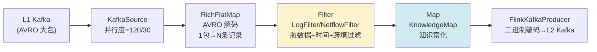
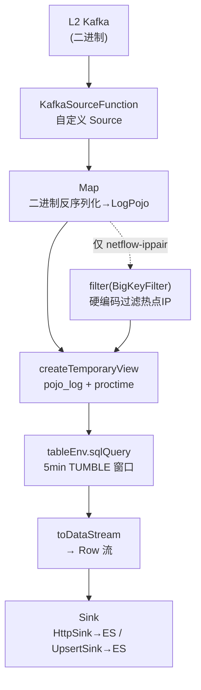
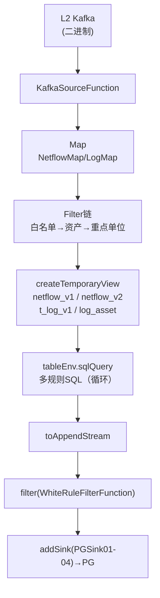

# Flink 大数据任务数据倾斜分析报告

> 生成时间：2026-08-05
> 分析范围：工程根目录下 3 个 Flink 模块（9 个实时 Job）
> 技术栈：Flink 1.14.2 / Java 8 / Scala 2.11 / Maven

---

## 一、工程总览

| 模块 | 路径 | 职责 | 包根 | Job 数 |
|---|---|---|---|---|
| `setl_flow` | `src/setl_flow/` | ETL：L1 Kafka 解码+富化+过滤 → L2 Kafka | `etl.flow` | 2 |
| `statistic_engine` | `src/statistic_engine/` | 统计：L2 Kafka → 5min 窗口聚合 → ES | `statistic` | 4 |
| `detect_engine` | `src/detect_engine/` | 检测：L2 Kafka → 多 SQL 规则 → PG | `detect` | 3 |
| `daymodels_engine` | `src/daymodels_engine/` | 离线日模型（Spark，非 Flink，本文忽略） | `statistics` | — |

### 9 个 Flink Job 入口类一览

| Job | 入口类 | 启动脚本 | API 风格 |
|---|---|---|---|
| log-setl | `etl.flow.LogFlinkStreamer` | `start_log_setl.sh` | DataStream API |
| netflow-setl | `etl.flow.NetflowFlinkStreamer` | `start_netflow_setl.sh` | DataStream API |
| log-ip-statistic | `statistic.LogIpMonitorMain` | `start_log_ip_statistic.sh` | Table API + SQL |
| log-ippair-statistic | `statistic.LogIpPairMonitorMain` | `start_log_ippair_statistic.sh` | Table API + SQL |
| netflow-ip-statistic | `statistic.NetFlowIpMonitorMain` | `start_netflow_ip_statistic.sh` | Table API + SQL |
| netflow-ippair-statistic | `statistic.NetFlowIpPairMonitorMain` | `start_netflow_ippair_statistic.sh` | Table API + SQL |
| log-detect | `detect.LogMain` | `start_log_detect.sh` | Table API + SQL |
| netflow-detect | `detect.NetflowMain` | `start_netflow_detect.sh` | Table API + SQL |
| netflow-count | `detect.NetflowCountMain` | `start_netflow_count.sh` | Table API + SQL + DataStream windowAll |

### 核心发现

**本项目几乎完全使用 Flink Table API/SQL 进行窗口聚合，不使用 DataStream API 的显式 `keyBy()`。** 分区/分组由 SQL 的 `GROUP BY` 子句隐式决定，Flink Table planner 会自动将 `GROUP BY` 的 key 转化为底层算子的 hash 分区。全工程搜索 `keyBy`、`partitionCustom`、`rebalance`、`rescale`、`shuffle` **零命中**（仅 Kafka 消费者层面的 `ConsumerRebalanceListener`，与 Flink 算子分区无关）。

---

## 二、各 Job 数据流图与分区分析

### 2.1 ETL 流（setl_flow）



**LogFlinkStreamer 数据流**（`start_log_setl.sh`，并行度=120）：
```
L1 Kafka → flatMap(AVRO解码) → filter(LogFilter) → map(LogKnowledgeMap) → sink(L2 Kafka)
```
- **无 KeyBy**：纯 map/filter 流水线，数据按 Kafka 分区自然分布，无重分区
- **形态突变**：1 条 AVRO 大包 flatMap 展开为上万条业务记录，是吞吐放大的关键点
- **filter 位置**：`filter(LogFilter)` 在 `map(KnowledgeMap)` **之前**执行，先过滤再富化（高效）

**NetflowFlinkStreamer 数据流**（`start_netflow_setl.sh`，并行度=60，source=30）：
```
L1 Kafka → flatMap(AVRO解码) → map(NetflowKnowledgeMap) → filter(NetflowFilter) → sink(L2 Kafka)
```
- **无 KeyBy**：纯 map/filter 流水线
- **filter 位置**：`filter(NetflowFilter)` 在 `map(KnowledgeMap)` **之后**执行，先富化再过滤

### 2.2 统计流（statistic_engine）— 4 个 Job



#### 2.2.1 IP 统计（log-ip / netflow-ip）

**SQL 模板**（`Constant.IP_SQL_TEMPLATE`）：
```sql
SELECT MIN(start_time), MAX(end_time), asset_ip,
       FIRST_VALUE(asset_name), sum(in_bytes), sum(out_bytes)
FROM pojo_log
WHERE CHAR_LENGTH(asset_name) <> 0
GROUP BY TUMBLE(proctime, INTERVAL '5' MINUTE), asset_ip
```
- **分组 key**：`TUMBLE(proctime, 5min) + asset_ip`
- **隐式分区**：Flink 按 `asset_ip`（Long 类型）做 hash 分区
- **增量聚合**：`SUM`、`MIN`、`MAX` 均为 Flink 内置增量聚合函数，状态不膨胀
- **倾斜风险**：⭐ **高** — 若某个 `asset_ip`（重点单位 IP）在 5 分钟窗口内产生海量连接，该 IP 对应的所有数据都会被 hash 到同一 subtask，导致该 subtask 负载远高于其他

#### 2.2.2 IP Pair 统计（log-ippair / netflow-ippair）

**SQL 模板**（`Constant.TCLOG_IP_PAIR_SQL_TEMPLATE` / `NETFLOW_IP_PAIR_SQL_TEMPLATE`）：
```sql
SELECT doc_id, MIN(start_time), MAX(end_time), FIRST_VALUE(asset_name), ...,
       SUM(in_bytes), SUM(out_bytes), ..., COUNT(peer_ip),
       TopOne(protocol), FlowTop1(asset_port,out_bytes), ...,
       PORT_DISTRIBUTION(asset_port,peer_port,out_bytes,in_bytes)
FROM pojo_log
GROUP BY TUMBLE(proctime, INTERVAL '5' MINUTE), doc_id
```
- **分组 key**：`TUMBLE(proctime, 5min) + doc_id`
- **doc_id 生成逻辑**（`ESUtil.getESDocId`）：`SHA-256(asset_ip + peer_ip)` 取前 16 字节 → 32 位 hex 字符串
- **隐式分区**：Flink 按 `doc_id`（String 类型）做 hash 分区
- **倾斜风险**：⭐⭐ **极高** — `doc_id` 本质是 `asset_ip + peer_ip` 的哈希，若某个 asset_ip 与大量 peer_ip 通信，会产生海量不同 doc_id，但所有 doc_id 的数据量都集中在该 asset_ip 的连接上。更严重的是，如果某个热门 IP 对（如某热点 DNS 服务器↔某网关）在 5 分钟内产生数百万条记录，这些记录的 doc_id 相同，全部 hash 到同一 subtask
- **增量聚合**：`SUM`/`COUNT`/`MIN`/`MAX` 增量；但 `TopOne`、`FlowTop1`、`PORT_DISTRIBUTION`、`PortTopNFunction` 等自定义 `AggregateFunction` UDF 在 accumulator 中维护 `Map`/`Set`/`List`，**状态会随窗口内不同端口数线性增长**

### 2.3 检测流（detect_engine）— 3 个 Job



#### 2.3.1 NetflowMain / LogMain（多规则检测）

**数据流**：
```
L2 Kafka → map(NetflowMap/LogMap) → filter(WhiteListFilter) → filter(AssetFilter) → 注册Table
→ 循环执行多条规则SQL → union合并 → filter(WhiteRuleFilterFunction) → addSink(PGSink)
```

**规则 SQL 分组 key 模式**（来自 `conf/detect_rule.sql`）：
| 规则类型 | GROUP BY key | 倾斜风险 |
|---|---|---|
| 流量趋势 | `TUMBLE(proctime, 5min)` 仅窗口，无维度 | ⭐ 低（全局聚合） |
| 大流量告警 | `TUMBLE + sip + dip` | ⭐⭐ 高（热门 IP 对） |
| 重点单位告警 | `TUMBLE + sip + dip` | ⭐⭐ 高 |
| Web邮箱端口 | `TUMBLE + sip + dip + dport` | ⭐ 中（端口进一步细分） |
| 数据库端口 | `TUMBLE + sip + dip + dport` | ⭐ 中 |

- **多条规则循环执行**：`for (Rule rule : rules) { tableEnv.sqlQuery(sql) }`，每条规则独立查询，结果 `union` 合并
- **无 KeyBy**：分组由 SQL GROUP BY 隐式决定

#### 2.3.2 NetflowCountMain（流量统计 — 唯一使用 DataStream windowAll 的 Job）

**数据流**：
```
L2 Kafka → map(NetflowMap) → 注册 netflow_v1/netflow_v2 Table
→ sqlQuery(FLOW_COUNT_SQL) [GROUP BY TUMBLE + sip]
→ toAppendStream(Row)
→ windowAll(TumblingProcessingTimeWindows.of(5min)).aggregate(FlowAggregator)  ← ⚠️ 全局聚合
→ addSink(PGSink01/02).setParallelism(1)  ← ⚠️ 强制并行度=1
```

**FLOW_COUNT_SQL**：
```sql
SELECT MAX(start_time), SUM(up_bytes), SUM(down_bytes)
FROM netflow_v1
GROUP BY TUMBLE(proctime, INTERVAL '5' MINUTE), sip
```

- **两阶段聚合**：第一阶段 SQL 按 `sip` 分组聚合（并行），第二阶段 `windowAll` 全局聚合
- **⚠️ 严重瓶颈**：`windowAll` 是 **non-keyed window**，所有数据强制汇聚到**单一 subtask**，Sink 并行度被硬编码为 `1`（`setParallelism(1)`）
- **倾斜风险**：⭐⭐⭐ **致命** — 即使上游 SQL 按 sip 并行聚合，windowAll 阶段所有结果仍汇聚到 1 个 TaskManager slot，成为吞吐天花板

### 2.4 各 Job 并行度配置汇总

| Job | 全局并行度 | Source 并行度 | Sink 并行度 | TM 内存 | Slots/TM |
|---|---|---|---|---|---|
| log-setl | 120 | 120 | — | 20g | 2 |
| netflow-setl | 60 | 30 | — | 30g | 2 |
| log-ip-statistic | 60 | 60 | — | 16g | 2 |
| log-ippair-statistic | 120 | 60 | — | 25g | 2 |
| netflow-ip-statistic | 60 | 60 | — | 12g | 2 |
| netflow-ippair-statistic | 180 | 60 | — | 30g | 3 |
| log-detect | 180 | 60 | 10 | 32g | 3 |
| netflow-detect | 180 | 60 | 30 | 35g | 3 |
| netflow-count | 120 | 60 | **1** ⚠️ | 30g | 4 |

---

## 三、现有数据倾斜处理方案汇总

| 方案 | 是否采用 | 实现位置 | 说明 |
|---|---|---|---|
| 自定义分区器（Partitioner） | ❌ 否 | — | 全工程无 `partitionCustom` 调用 |
| Salting（加盐）策略 | ❌ 否 | — | 无任何加盐/随机前缀逻辑 |
| 两阶段聚合（Local+Global） | ⚠️ 部分 | `NetflowCountMain` | SQL 按 sip 聚合后 `windowAll` 全局聚合，但 windowAll 并行度=1，等于退化为单阶段 |
| KeyBy 前 filter 过滤无效数据 | ✅ 是 | ETL 层 `LogFilter`/`NetflowFilter`；检测层 `WhiteListFilter`/`AssetFilter`/`KeyUnitFilter` | 过滤脏数据（>10TB/超7天/未跨境/零流量）和白名单/非重点单位 |
| **硬编码热点 IP 过滤** | ✅ 是 | `BigKeyFilter` | **唯一显式倾斜处理**：硬编码过滤某热点公网 IP，仅用于 netflow-ippair-statistic |
| rebalance/rescale 打散 | ❌ 否 | — | 无任何调用 |
| 增量聚合（AggregateFunction） | ✅ 是 | 大量 UDF | `SUM`/`COUNT`/`MIN`/`MAX` + 自定义 `TopOneFunction`/`FlowTop1PortFunction`/`PortDistributionFunction` 等 |
| 全窗口聚合（ProcessWindowFunction） | ❌ 否 | — | 无 `ProcessWindowFunction`，全部使用增量 `AggregateFunction` |
| miniBatch 微批优化 | ❌ 否 | — | 未配置 `table.exec.mini-batch.enabled` |

### BigKeyFilter 详解（唯一的显式倾斜处理）

```java
// statistic/udf/BigKeyFilter.java
public class BigKeyFilter extends RichFilterFunction<LogPojo> {
    private final HashSet<Long> ips = new HashSet<>();
    public void open(Configuration parameters) {
        this.ips.add(HOT_IP_LONG);  // 某热点公网 IP 的 Long 表示
    }
    public boolean filter(LogPojo value) {
        if (value == null) return false;
        return !ips.contains(value.getAsset_ip()) && !ips.contains(value.getPeer_ip());
    }
}
```
- **仅用于** `NetFlowIpPairMonitorMain`，在 `map` 之后、注册 Table 之前过滤
- **硬编码**某热点公网 IP（以常量形式写入代码），直接丢弃该 IP 的所有 IP Pair 统计数据
- **问题**：① 热点 IP 列表写死在代码中，无法动态调整；② 数据被直接丢弃而非打散，影响统计完整性；③ 仅 netflow-ippair 使用，log-ippair 未使用

---

## 四、潜在倾斜风险点分析

### 风险点 1：IP Pair 统计的 doc_id 分组 ⭐⭐⭐ 极高

**位置**：`LogIpPairMonitorMain` / `NetFlowIpPairMonitorMain`

**原因**：
- `doc_id = SHA-256(asset_ip + peer_ip)` 是确定性的，相同 IP 对的 doc_id 恒定
- 若某重点单位 IP 与热门外部 IP（如 CDN、DNS）在 5 分钟内产生百万级连接，所有记录 hash 到同一 subtask
- 自定义 UDF（`PortDistributionFunction`、`PortTopNFunction`）在 accumulator 中维护 `Map<Integer, PortStats>`，状态随端口数增长，加剧内存压力

**影响**：窗口触发时该 subtask OOM 或处理延迟，背压传导至 Source

### 风险点 2：NetflowCountMain 的 windowAll 单点瓶颈 ⭐⭐⭐ 致命

**位置**：`NetflowCountMain`

**原因**：
```java
DataStream<Row> aggregatedStream = flowStream
    .windowAll(TumblingProcessingTimeWindows.of(Time.minutes(5)))  // non-keyed, 并行度=1
    .aggregate(new FlowAggregator());
aggregatedStream.addSink(pgSink01).setParallelism(1);  // 强制单并行度
```
- `windowAll` 是 non-keyed window，整个流汇聚到 1 个 subtask
- Sink 并行度被 `setParallelism(1)` 硬编码
- 即使上游 SQL 按 sip 并行聚合，最终全局聚合仍单点

**影响**：该 Job 吞吐上限被 windowAll 单 subtask 限制，5 分钟窗口数据量增大时极易背压

### 风险点 3：IP 统计的 asset_ip 分组 ⭐⭐ 高

**位置**：`LogIpMonitorMain` / `NetFlowIpMonitorMain`

**原因**：
- `GROUP BY TUMBLE(proctime, 5min), asset_ip`，asset_ip 为重点单位 IP
- 重点单位天然是流量大户（跨境异常流量监控场景），IP 分布严重不均
- 某些重点单位 IP 可能占整个窗口数据量的 30%+ 

### 风险点 4：检测层多规则 sip+dip 分组 ⭐⭐ 高

**位置**：`NetflowMain` / `LogMain` + `conf/detect_rule.sql`

**原因**：
- 大量规则使用 `GROUP BY TUMBLE + sip + dip`，热门 IP 对（如境内网关↔境外 CDN）数据量极大
- `HAVING SUM(up_bytes) >= 10GB/100MB` 阈值过滤在聚合后执行，无法减少聚合阶段的倾斜
- `CONCAT_LOG(ROW_TO_JSON(...))` UDF 在 accumulator 中维护 `List<String>`，对热门 IP 对会累积海量日志字符串

### 风险点 5：ETL 层 AVRO 解码的 flatMap 放大 ⭐ 中

**位置**：`LogFlinkStreamer` / `NetflowFlinkStreamer` 的 `RichFlatMapFunction`

**原因**：
- 1 条 AVRO 大包可展开为上万条业务记录，flatMap 输出量远大于输入
- 若某些 Kafka 分区的 AVRO 大包特别大（包内记录数极多），该分区对应 subtask 负载远高于其他
- 虽无 KeyBy，但 flatMap 输出后直接 filter/map，无重分区，不均匀会传递到 Kafka sink

---

## 五、改进建议

### 建议 1：为 IP Pair 统计引入两阶段聚合（Local Aggregation + Global Aggregation）

**目标**：打散 `doc_id` 热点，避免单 subtask 处理热门 IP 对的全部数据

**方案**：在 SQL 中使用加盐 + 去盐的两阶段聚合（Flink 1.14 可通过嵌套 SQL 实现）

```sql
-- 第一阶段：加盐局部聚合（打散热点）
SELECT
    CONCAT(doc_id, '_', FLOOR(RAND() * 10)) AS salted_key,
    TUMBLE_START(proctime, INTERVAL '5' MINUTE) AS win_start,
    SUM(in_bytes) AS local_in_bytes, SUM(out_bytes) AS local_out_bytes,
    COUNT(*) AS local_count, ...
FROM pojo_log
GROUP BY TUMBLE(proctime, INTERVAL '5' MINUTE), doc_id, FLOOR(RAND() * 10)

-- 第二阶段：去盐全局聚合（合并结果）
SELECT
    SUBSTRING(salted_key, 1, 32) AS doc_id,  -- 去掉盐后缀
    SUM(local_in_bytes) AS in_bytes, SUM(local_out_bytes) AS out_bytes, ...
FROM stage1_result
GROUP BY win_start, SUBSTRING(salted_key, 1, 32)
```

> ⚠️ 注意：自定义 UDF（TopOne/PortDistribution）难以直接用于两阶段聚合，需改造为可合并的 accumulator（实现 `merge()` 方法）。当前 UDF 的 accumulator 是 `Map`/`Set`/`List`，天然可合并。

### 建议 2：消除 NetflowCountMain 的 windowAll 单点瓶颈

**当前**：
```java
flowStream.windowAll(TumblingProcessingTimeWindows.of(5min)).aggregate(new FlowAggregator());
// → 强制并行度=1
```

**改进**：直接在 SQL 中完成全局聚合，利用 Flink planner 的自动并行度
```java
// 直接用单条 SQL 完成，无需 windowAll
String FLOW_COUNT_SQL = "SELECT MAX(start_time), SUM(up_bytes), SUM(down_bytes) " +
    "FROM netflow_v1 GROUP BY TUMBLE(proctime, INTERVAL '5' MINUTE)";
// 去掉 .setParallelism(1)，让 Sink 跟随全局并行度
```
若 PG 写入确实需要单并行度（避免并发写入冲突），可在 Sink 前加 `keyBy(常量)` 将数据汇聚到一个 subtask，但不影响聚合阶段的并行度。

### 建议 3：BigKeyFilter 改为动态配置 + 软打散

**当前问题**：硬编码 IP、直接丢弃数据、仅 1 个 Job 使用

**改进**：
1. 热点 IP 列表从 `env.conf` 或 PG 表动态加载（可运行时更新）
2. 对热点 IP 不直接丢弃，而是采样或限流（如每 100 条取 1 条，或按时间窗口限流）
3. 在 log-ippair-statistic 中也启用 BigKeyFilter（当前缺失）

### 建议 4：开启 Table API miniBatch 优化

在 `StreamTableEnvironment` 创建后添加配置：
```java
tableEnv.getConfig().getConfiguration().setString(
    "table.exec.mini-batch.enabled", "true");
tableEnv.getConfig().getConfiguration().setString(
    "table.exec.mini-batch.allow-latency", "5s");
tableEnv.getConfig().getConfiguration().setString(
    "table.exec.mini-batch.size", "5000");
tableEnv.getConfig().getConfiguration().setString(
    "table.optimizer.agg-phase-strategy", "TWO_PHASE");  // 两阶段聚合
```
- miniBatch 减少 state 访问频率
- `TWO_PHASE` 聚合策略让 Flink planner 自动生成 local+global 两阶段聚合 plan

### 建议 5：检测层 CONCAT_LOG UDF 状态优化

**问题**：`CONCAT_LOG` 的 accumulator 是 `List<String>`，对热门 IP 对会累积海量 JSON 日志

**改进**：
1. 限制 accumulator 中保留的日志条数（如 Top 100 条）
2. 或改为只统计计数，详细日志异步写 HDFS/对象存储
3. `CONCAT_STR(flow_id)` 同理，限制 flow_id 列表长度

### 建议 6：ETL 层 flatMap 后增加 rebalance

**问题**：AVRO 大包展开后数据量不均，且无重分区

**改进**（仅当观察到 Source 分区不均时）：
```java
DataStream<Map<String, Object>> outputLog = log.flatMap(...)
    .filter(new LogFilter(...))
    .map(new LogKnowledgeMap(...))
    .rebalance();  // 在 sink 前打散
```
> ⚠️ 仅在确认分区不均时使用，rebalance 会引入网络 shuffle 开销

---

## 六、总结

| 维度 | 现状 | 评价 |
|---|---|---|
| 分区策略 | 全部依赖 SQL GROUP BY 隐式 hash 分区 | 基本合理，但对热点 key 无防护 |
| 倾斜处理 | 仅 `BigKeyFilter` 硬编码过滤 1 个 IP | 严重不足，且仅覆盖 1/9 Job |
| 聚合方式 | 全部增量聚合（AggregateFunction），无全窗口 | ✅ 正确，状态不膨胀 |
| windowAll 使用 | `NetflowCountMain` 使用 non-keyed windowAll | ⚠️ 致命瓶颈，并行度=1 |
| UDF 状态管理 | TopOne/PortDistribution 等 accumulator 可合并 | ✅ 具备两阶段聚合改造基础 |
| 过滤前置 | ETL 层 filter 在 map 前后，检测层多级 filter | ✅ 合理，有效减少下游数据量 |
| 配置化 | 并行度/内存写死在启动脚本中 | ⚠️ 无法动态调整 |

**优先级排序**：
1. 🔴 **P0**：消除 `NetflowCountMain` 的 `windowAll` 单点瓶颈（影响整个 Job 吞吐）
2. 🔴 **P0**：为 IP Pair 统计引入两阶段聚合（影响 2 个统计 Job 稳定性）
3. 🟡 **P1**：BigKeyFilter 动态化 + 扩展到 log-ippair
4. 🟡 **P1**：开启 miniBatch + TWO_PHASE 聚合优化
5. 🟢 **P2**：CONCAT_LOG UDF 状态限制
6. 🟢 **P2**：ETL 层 rebalance（按需）
